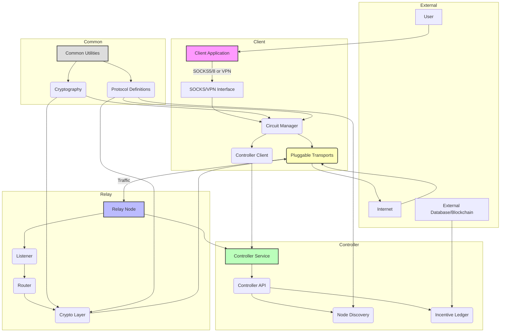

# PhantomBand Supreme Architecture

This document details the high-level architecture and component interactions of the PhantomBand Supreme anonymity network.

## 1. Overview

PhantomBand Supreme is designed as a modular, multi-layered system, separating concerns into distinct crates (Rust modules) for clarity, maintainability, and security. The core principle is to provide robust anonymity through a hybrid onion routing and mixnet approach, coupled with advanced stealth techniques.

## 2. Component Diagram

## 3. Component Breakdown

### 3.1 `client` Crate

*   **`main.rs`**: Client application entry point, orchestrates other client modules.
*   **`config.rs`**: Handles client configuration, command-line arguments, and settings.
*   **`controller.rs`**: Manages communication with the `controller` service for node discovery and updates.
*   **`circuit.rs`**: Core logic for building, managing, and tearing down multi-hop circuits. Responsible for onion encryption/decryption layers.
*   **`socks.rs`**: Implements a SOCKS5/8 proxy interface for applications to connect to PhantomBand.
*   **`vpn.rs`**: (Optional) Implements a VPN service interface for system-wide traffic redirection.
*   **`utils.rs`**: Client-specific utility functions.

### 3.2 `relay` Crate

*   **`main.rs`**: Relay node entry point.
*   **`listener.rs`**: Handles incoming connections from clients or other relays, potentially using pluggable transports.
*   **`router.rs`**: Decides the next hop for incoming traffic based on circuit information and performs mixnet-style batching and shuffling.
*   **`crypto.rs`**: Performs per-hop decryption and re-encryption of traffic.
*   **`utils.rs`**: Relay-specific utility functions.

### 3.3 `controller` Crate

*   **`main.rs`**: Controller service entry point.
*   **`api.rs`**: Provides a REST/gRPC API for clients and relays to interact with the controller (e.g., for node discovery).
*   **`discovery.rs`**: Implements decentralized node discovery mechanisms (DHT, gossip protocol) and anti-sybil measures.
*   **`ledger.rs`**: (Optional) Manages the privacy-preserving incentive ledger for bandwidth contributors.

### 3.4 `transports` Crate

*   **`lib.rs`**: Defines the `PluggableTransport` trait and re-exports specific transport implementations.
*   **`trait.rs`**: Defines the `PluggableTransport` trait, specifying `connect` and `listen` methods for various transport types.
*   **`quic.rs`**: Implements a QUIC-based transport, mimicking common QUIC traffic patterns.
*   **`doh.rs`**: Implements DNS-over-HTTPS/QUIC transport, encapsulating PhantomBand traffic within DNS queries.
*   **`websocket.rs`**: Implements WebSocket over TLS transport.
*   **`obfs4.rs`**: Integrates or implements obfs4-like obfuscation techniques.
*   **`traffic_shaping.rs`**: Applies padding, random delays, and cover traffic to obscure traffic patterns.

### 3.5 `common` Crate

*   **`lib.rs`**: Re-exports common modules.
*   **`crypto.rs`**: Provides shared cryptographic primitives (key exchange, AEAD, hashing, signatures, post-quantum).
*   **`protocol.rs`**: Defines common protocol messages, cell formats, and data structures used across all components.
*   **`utils.rs`**: General utility functions used by multiple crates.

## 4. Data Flow

1.  **Client Initialization:** Client starts, reads configuration, and connects to the `controller` for initial node discovery.
2.  **Circuit Building:** Client selects a path of relays and iteratively builds a multi-hop circuit, performing layered encryption.
3.  **Traffic Encapsulation:** Application traffic (from SOCKS/VPN) is encapsulated into fixed-size cells, encrypted, and sent through the circuit.
4.  **Relay Processing:** Each relay in the circuit decrypts one layer, performs mixnet shuffling (batching, reordering, delaying), and forwards the traffic to the next hop.
5.  **Exit Node:** The final relay (exit node) decrypts the last layer and forwards the traffic to the destination on the clear internet.
6.  **Response:** Responses follow the reverse path, undergoing layered encryption at each relay.

## 5. Security Considerations

*   **Modularity:** Clear separation of concerns limits the impact of vulnerabilities.
*   **Rust:** Memory safety and concurrency safety provided by Rust.
*   **Fuzzing:** Extensive fuzz testing on protocol parsers and cryptographic implementations.
*   **Ephemeral State:** Minimizing persistent state on relays and clients to enhance plausible deniability.

## 6. Future Enhancements

*   Integration with satellite/mesh networks for enhanced resilience.
*   AI-driven path selection for optimal anonymity/latency trade-offs.
*   Hardware token support for stronger PFS.
